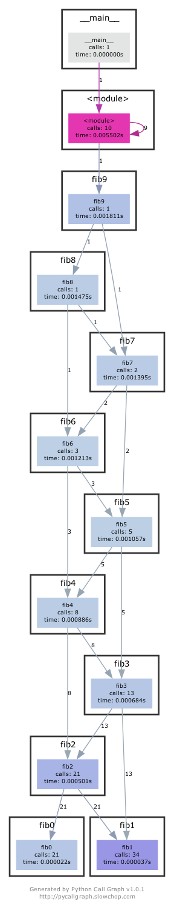
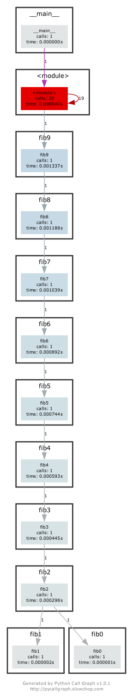

# Debugging and Profiling
## Debugging

1. Use journalctl on Linux or log show on macOS to get the super user accesses and commands in the last day. If there aren’t any you can execute some harmless commands such as sudo ls and check again.

`journalctl --since "yesterday" | grep "sudo"`

2. Install shellcheck and try checking the following script. What is wrong with the code? Fix it. Install a linter plugin in your editor so you can get your warnings automatically.

```
Line 3:
for f in $(ls *.m3u)
         ^-- SC2045 (error): Iterating over ls output is fragile. Use globs.
              ^-- SC2035 (info): Use ./*glob* or -- *glob* so names with dashes won't become options.
 
Line 5:
  grep -qi hq.*mp3 $f \
           ^-- SC2062 (warning): Quote the grep pattern so the shell won't interpret it.
                   ^-- SC2086 (info): Double quote to prevent globbing and word splitting.

Did you mean: (apply this, apply all SC2086)
  grep -qi hq.*mp3 "$f" \
 
Line 6:
    && echo -e 'Playlist $f contains a HQ file in mp3 format'
            ^-- SC3037 (warning): In POSIX sh, echo flags are undefined.
               ^-- SC2016 (info): Expressions don't expand in single quotes, use double quotes for that.
```

## Profiling
5. Here are some sorting algorithm implementations. Use cProfile and line_profiler to compare the runtime of insertion sort and quicksort. What is the bottleneck of each algorithm? Use then memory_profiler to check the memory consumption, why is insertion sort better? Check now the inplace version of quicksort. Challenge: Use perf to look at the cycle counts and cache hits and misses of each algorithm.

Use `$ python -m cProfile -s tottime sorts.py | tac` to get runtime of insertion sort and quicksort functions.

```
   79389    0.011    0.000    0.060    0.000 random.py:334(randint)
34512/1000    0.017    0.000    0.026    0.000 sorts.py:23(quicksort)
    79389    0.018    0.000    0.024    0.000 random.py:237(_randbelow_with_getrandbits)
33380/1000    0.018    0.000    0.019    0.000 sorts.py:32(quicksort_inplace)
     1000    0.021    0.000    0.021    0.000 sorts.py:11(insertionsort)
    79389    0.025    0.000    0.049    0.000 random.py:290(randrange)
   ncalls  tottime  percall  cumtime  percall filename:lineno(function)

   Ordered by: internal time

         597900 function calls (531981 primitive calls) in 0.141 seconds
```

Install memory profiler using `pip install memory_profiler`.

6. Put the Python code into a file and make it executable. Install prerequisites: `pycallgraph` and `graphviz`. (If you can run dot, you already have GraphViz.) Run the code as is with `pycallgraph graphviz -- ./fib.p`y and check the pycallgraph.png file. How many times is fib0 called?. We can do better than that by memoizing the functions. Uncomment the commented lines and regenerate the images. How many times are we calling each fibN function now?

```python
#!/usr/bin/env python
def fib0(): return 0

def fib1(): return 1

s = """def fib{}(): return fib{}() + fib{}()"""

if __name__ == '__main__':

    for n in range(2, 10):
        exec(s.format(n, n-1, n-2))
    # from functools import lru_cache
    # for n in range(10):
    #     exec("fib{} = lru_cache(1)(fib{})".format(n, n))
    print(eval("fib9()"))


```

The output of `pycallgraph` is shown below, and `fib0` is called 21 times.


After memoizing the functions, the graph is shown below; `fib0` is only called 1 time; every function `fibN` is called only once.


7. A common issue is that a port you want to listen on is already taken by another process. Let’s learn how to discover that process pid. First execute `python -m http.server 4444` to start a minimal web server listening on port 4444. On a separate terminal run `lsof | grep LISTEN` to print all listening processes and ports. Find that process pid and terminate it by running `kill <PID>`.


